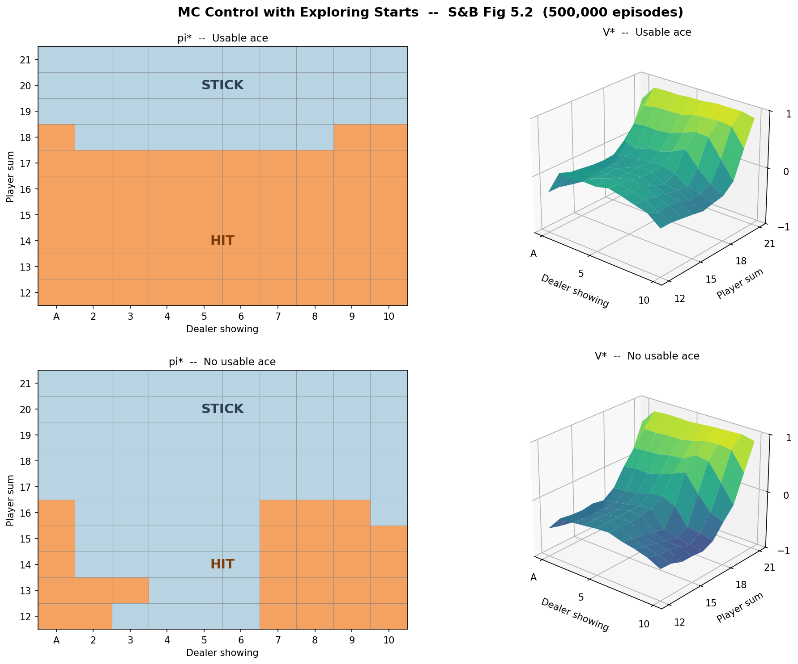
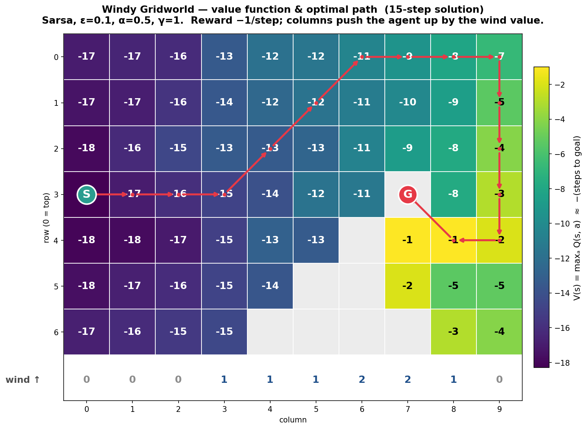
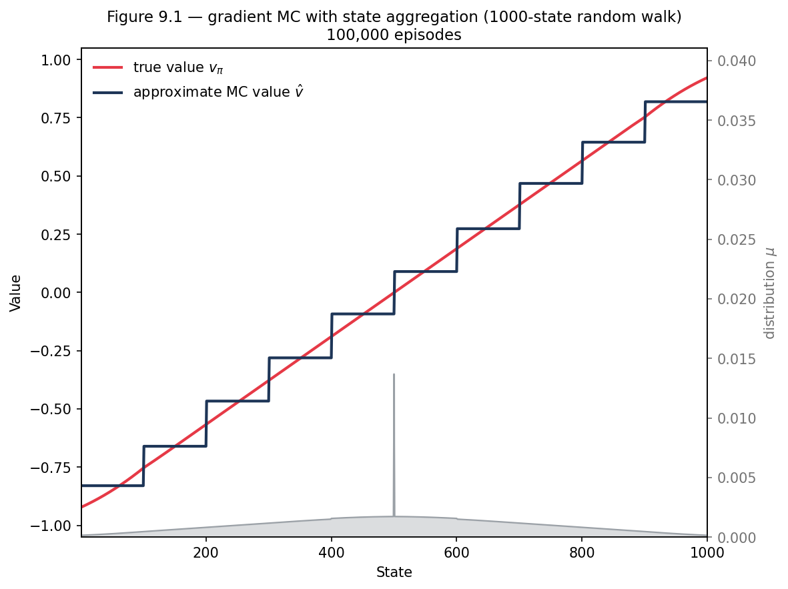

# Reinforcement Learning

Reinforcement learning algorithms with mathematical derivations and reproductions of figures from Sutton & Barto, *Reinforcement Learning: An Introduction* (2nd ed., 2020).

Theoretical foundations live in [`Sequential-Decision-Making`](https://github.com/SaiSampathKedari/Sequential-Decision-Making). Deep-RL methods will live in [`Deep-Reinforcement-Learning`](https://github.com/SaiSampathKedari/Deep-Reinforcement-Learning).

## Setup

```bash
git clone https://github.com/SaiSampathKedari/Reinforcement-Learning
cd Reinforcement-Learning
python -m venv .venv && source .venv/bin/activate
pip install -e .
```

Requires Python ≥ 3.10.

## Layout

- `src/rl/`: algorithms and environments (see [`src/rl/README.md`](src/rl/README.md) for the package map).
- `notebooks/`: experiments, one folder per environment.
- `reports/`: derivations, proofs, and convergence analysis.

## Algorithms

| Category | Algorithms | Status |
|---|---|:--:|
| Model-free prediction | MC prediction, TD(0), n-step TD, TD(λ) | ● |
| Model-free control | Sarsa, Q-learning, n-step Sarsa, Sarsa(λ) | ● |
| Dynamic programming | policy evaluation; policy & value iteration | ◐ |
| Model-based & planning | Dyna-Q, prioritized sweeping | ○ |
| Value-function approximation | gradient MC, state aggregation; semi-gradient TD / Sarsa, tile coding | ◐ |
| Policy gradient | REINFORCE, REINFORCE with baseline | ○ |
| Actor-critic | one-step actor-critic, advantage actor-critic (A2C) | ○ |
| Trust-region & proximal methods | natural policy gradient, TRPO, PPO | ○ |

<sub>● implemented &nbsp;·&nbsp; ◐ partial &nbsp;·&nbsp; ○ planned</sub>

## Environments

| Environment | Source | Status | Notebook |
|---|---|:--:|---|
| Blackjack | S&B §5.1 | ● | [`01_blackjack`](notebooks/01_blackjack/) |
| Windy Gridworld | S&B Example 6.5 | ● | [`02_windy_gridworld`](notebooks/02_windy_gridworld/) |
| Random Walk | S&B Examples 6.2 / 7.1 / 9.1 | ● | [`03_random_walk`](notebooks/03_random_walk/) |
| Cliff Walking | S&B Example 6.6 | ○ | |
| FrozenLake | Gymnasium | ○ | |
| Dyna Maze | S&B Example 8.1 | ○ | |
| Mountain Car | S&B Example 10.1 | ○ | |
| Acrobot | Classic control | ○ | |
| CartPole | Classic control | ○ | |
| Short Corridor | S&B Example 13.1 | ○ | |

<sub>● implemented &nbsp;·&nbsp; ○ planned</sub>

## Contact

- Email: sampath@umich.edu
- LinkedIn: [sai-sampath-kedari](https://www.linkedin.com/in/sai-sampath-kedari)

## Gallery

<table>
<tr>
<td align="center" width="50%">
<b>Blackjack</b>: optimal policy π* and value V* (S&amp;B Fig 5.2)<br><br>

</td>
<td align="center" width="50%">
<b>Windy Gridworld</b>: value V(s) and 15-step optimal path (S&amp;B Ex. 6.5)<br><br>

</td>
</tr>
<tr>
<td align="center" width="50%">
<b>Random Walk</b>: gradient MC with state aggregation vs true v&#960; (S&amp;B Fig 9.1)<br><br>

</td>
<td align="center" width="50%"></td>
</tr>
</table>
